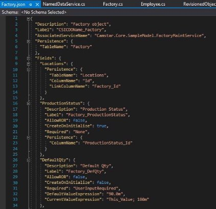

---
title: "Modular MOM"
url: /modular-mom/
#notoc: true
description: "The is section for Modular MOM Metamodel Documentation."
weight: 5  
#no_list: false
#cascade: 
#    - space: "Modular MOM"
#    - mmom_version: ""
#If moving or renaming this doc file, implement a temporary redirect and let the respective team know they should update the URL in the product. See Mapping to Products for more details.
---
The is section for Modular MOM Metamodel Concepts, Design of Metamodel & Metadata

Author: [Ramesh Nagamalli](/ramesh.nagamalli@siemens.com/) 
    
    Senior Key Expert 
    DI SW MOM R&D AI RI  

## Metamodel Concepts 

### Introduction 

* In Metadata-driven systems/architectures, the Metadata forms the crux of the business solution the system provides. The structure and the form of the metadata is governed by the Metadata DSL or the Metamodel. As Modular MOM is built using the Metadata-driven architecture, there is a specific Metamodel that is used to define the Metadata for Modular MOM. 

### The Basics 

* Modular MOM Metamodel is inspired from the architecture & Metamodel of Opcenter Ex Core. The salient features of the Modular MOM Metamodel are: 
- **Object-Oriented**: Enables the definition of metadata that adheres to the OO principles, such as Abstraction, Encapsulation, Inheritance & Polymorphism
- **Imperative**: The logic definition adheres to the imperative programming paradigm
- **Strongly Typed**: Provides a Strong Type System for the primary components of the Metadata, but it also allows for some **dynamic** types to be used in the logic definitions 
- **Relational**: Enables the definition of an Object Model which is based on Relational Model and supports relationships like Association, Composition & Aggregation 
- **Aspect-Oriented**: Enables adding of cross-cutting functionality based on annotations like in an aspect-oriented programming paradigm 
- **Persistence**: Enables configurable Object-Relational Mapping based persistence mechanism for the user data 

### The Design 

The ‘Configurable Object’ forms the core of the Metamodel design. Since the Metadata adheres to the OO principles, a ‘Class or Object Type’ that describes an ‘object instance’ becomes the central idea of the Metadata, and, the ‘Configurable Object’ enables the 

creation of these ‘Classes’ or ‘Object Types’. Applying the Metadata Abstraction level concepts from the ‘The OMG Group’, the ‘Configurable Object’ represents an instance at M2 level, that means that the instances of the ‘Configurable Objects’ represent the instance at M1 level, which, form the ‘type’ definitions for the object instances at M0 level - the actual instance data. 

#### The ‘Configurable Object’ 

The ‘Configurable Object’ is composed of: 

- **Fields**: These define the ‘properties’ of the object. There are several predefined types of ‘Field’ definitions that can be used to define the properties on an object. 
- **Methods**: The logic associated with the objects are defined as methods like in any Object-Oriented programming language 
- **Event Handlers**: Every ‘Configurable Object’ has a set of pre-defined object life-cycle related events that are automatically fired by the system during the life of an object based on some external or internal triggers. Event-Handlers are the logic blocks that could be associated to these built-in event types. These event handlers get executed when these ‘events’ are fired during the life of an object instance.
- **Field Event-Handlers**: The ‘Fields’ also have some pre-defined life-cycle events that are fired by the system on external of internal triggers like in the case of an object. Event handlers, logic block, can be associated to these events to configure any logic to be executed when these events are fired.
- **Attributes**: These define additional characteristics that could be related to the aspects that are either used at the ‘design’ time by the configuration tools or behavioral aspects that could take effect at the system runtime. These ‘Attributes’ can be defined both at the ‘Configurable Object’ level and at the ‘Field’ level as well. Examples include: ‘Description’ – which describes the item, ‘Category’ – which puts the object into a particular group which could be used by the configuration tools, ‘Cache-able’ – which defines if this the instances of this object could be cached by the system at runtime, etc. ‘Attributes’ are further classified into 2 categories:
- **Overridable –** these attributes can be overridden by the sub-classes or by customizations 
- **Non-Overridable –** these attributes are NOT allowed to be overridden by the sub-classes or by customizations 
- **Persistence Options**: These provide the ORM mapping to facilitate the object instance to be persisted into a database storage (more details in separate section…)

#### Object Categories 

Configurable Objects are classified into the following high-level types based on the intended purpose of the objects. 

**Business Objects**: Objects in this category are intended to represent the concepts from the Business domain model. 

**Service Objects**: Business operations are modelled using the Service type of objects and these objects become the interface between the external world and this metadata-based system. Service definitions serve the purpose of an API to the business services provided by this metadata. Every interaction with the external world other than just querying the model is always through the execution of a ‘Service’ type of object. 

**Persistent Objects**: The state of the Business Objects which represent the concepts from the Business domain model are typically persisted in some form of storage. This Metamodel provides a framework through ORM to facilitate the persistence of these objects. The Business Objects that are configured to be persistent are called or classified as ‘Persistent Objects’ 

**Transient Objects**: Objects such as Service objects and some Business Objects that do not require the state to be persisted are called as Transient Objects. The main purpose of these transient objects is to aid during the execution of business functionality to keep and track some internal state but are not required to be persisted.

**Named Objects**: All objects have a unique identifier assigned automatically by the system to identify and reference these objects. Some Business Objects within the business domain model that can be identified by a unique name are called ‘Named’ objects. The name serves the purpose of an alternate logical key for the object.

**Revisioned Objects**: Object Revision Control is the ability of an object to have multiple revisions and still be able to be managed as one object. Objects that support revision control are generally referred to as ‘Revisioned Objects’. Within this Metamodel, Revisioned Objects implement the following pattern for revision control mechanism.  

- Revisioned Objects are standard objects like any other Business object
- Revisioned Objects can have one or more ‘Revisions’  
- Revisioned Objects will have ONE revision marked as 'Revision of Record', aka ‘RoR’  
- Revisioned Objects have the following 2 alternate logical keys of identification: 
1. Name only, which always refers to the current ‘RoR’ object 
1. Name and Revision, which uniquely identifies a specific single revision 

**Subentity Objects**: Composable objects and are also called as Subentity objects. 

**Named Subentity Objects**: Subentity objects can, optionally, be ‘Named’ objects such as that they can be uniquely identified by a name within the context of it composing object.

#### Field Types 

At the highest level, the fields fall into the 2 broad categories – Scalar (Single-valued) or List (Multi-valued) types. Within each of these categories these are the several ‘data’ types that are supported by the Metamodel type system:

**Primitive Types**: Basic data types like ‘String’, Boolean’ ‘Datetime’ and numeric types like Integer & Decimal are supported. 

**Complex Types**: Complex Types are used to represent Object relationships. The following types of relationships are supported: Association, Composition, Aggregation 

#### Object Relationships 

Relationship between Objects are explicitly expressed through ‘Object’ Type Fields like any other Field. 

**Inheritance**: This Metamodel implements Single Inheritance Model only with full support for polymorphism. 

- Navigation between the object and its super classes is through the ‘this’ or ‘base’ like keywords as defined by the underlying language 

**Association**:  An association is a “using” relationship between two or more objects in which the objects have their own lifetime and there is no owner. Association can also be defined as a semantically weak relationship between otherwise unrelated objects. Associated objects can be referenced by Id or any of the alternate logical keys to uniquely identify the object. A few aspects of the ‘Association’ relationship within this Metamodel are:

- Navigation between related objects are implicitly expressed by the Fields defined 
- One-way navigation is implied in the direction defined by the user in the form of a Field 

- Back-navigation needs to be explicitly expressed by the user
- Back-navigation could automatically be configured through the tool automations, if needed 

**Composition**: Composition is a strong type of relationship like in whole/part or parent/child relationship. Composition defines ‘ownership’ between the composing & composed objects, such that, if the lifecycle of the composed objects is linked to the composing object. For example, when the composing object is destroyed, then the composed objects also cease to exist. Within this Metamodel, a composed object is called as ‘**Subentity**’ and the creation of these Subentity objects are always within the context of the parent/owner/composing 

object. Navigation aspects of this relationship are:  

- Forward navigation expressed explicitly by the user when defining composition
- Back-navigation is provided automatically through ‘Parent’ field 

**Aggregation**: It is a specialized form of relationship to represent a collection - One-to-Many multiplicity dimension. Aggregation supports both ‘Association’ & ‘Composition’ types with navigation aspects being same as the underlying relationship type. 

#### Object and Field Life-Cycle Events 

**OBJECT EVENTS**

**OnInitialize**: Triggered when the object is created. Provides hooks to initialize the object with custom logic 

**PERSISTENT OBJECT EVENTS**

**AfterOpen**: Triggered when an object is retrieved from the storage and after the internal initialization is complete. Provides hooks for custom logic to initialize/update the state and/or initialize the non-persistent state of the object 

**BeforeSave**: Triggered when an object is ready to be persisted to the storage to provide hooks for any custom logic to adjust the state of the object before it gets persisted 

**SERVICE OBJECT EVENTS**

**BeforeValidate**: Triggered as part of Service execution but before the system validation is performed to provide hooks for custom logic to manipulate the object state before the system validation 

*Internal System Validate*: Validate the input requirements of all the fields from the service & its details. It is NOT a hook for customization. 

**AfterValidate**: Triggered as part of Service execution but after the system validation is performed to provide hooks for custom logic to manipulate the object state for the actual service execution 

**BeforeExecute**: Triggered as part of Service execution but after all the validations are performed and provides hooks for custom logic to manipulate the object state as required for the service 

*Internal System Execute*: Internal system logic and it is NOT a hook for customization 

**AfterExecute**: Triggered as part of Service execution and after ‘BeforeExecute’ event is performed and provides additional hooks for custom logic to manipulate the object state as required for the service before the object state (transaction) is committed to the storage

**AfterCommit**: Triggered as part of Service execution and after the object state is successfully committed to the persistent storage providing hooks for any custom logic to do notifications or integration with other systems etc. 

**AfterCommitEventFailure**: Triggered as part of Service execution and on failure of the ‘AfterCommit’ event providing hooks for custom logic to handle any failures occurring during the ‘AfterCommit’ event. This event is fired ONLY when ‘AfterCommit’ event fails 

**FIELD EVENTS**

**OnInitialize**: Triggered when the object is created to provide hooks into initializing field with custom logic

**OnGetField**: Triggered when the value of a field is requested by the consumer of the object to provide hooks into executing custom logic to return the value of the field

**OnSetField**: Triggered when the value is assigned to a field by the consumer of the object to provide hooks into executing custom logic to assign the value for the field or to manipulate any other state 

**OnSelectValues**: Triggered when there is an explicit request to retrieve ‘List of Values’ or ‘Selection Values’ for a specific field. This is mostly used to populate the ‘List of Values’ on a UI component. It could also be used to perform any custom logic validations of the field to restrict the values to the pre-configured set only checking the field value against the 

selection values 

**LIST FIELD EVENTS**

**GetItem**: Triggered when a single item is requested from a list field to provide hooks for any custom logic to be executed 

**AddItem**: Triggered when an item is added to a list field to provide hooks for any custom logic to be executed 

**UpdateItem**: Triggered when a single item is updated on a list field to provide hooks for any custom logic to be executed 

**DeleteItem**: Triggered when an item is removed from a list field to provide hooks for any custom logic to be executed. When the list field represents a ‘Composition’ type of object relationship then the item being removed from the list is also explicitly deleted.

#### Configurable Object Maps 

Configurable Object Map, also known as a CDO Map, is a feature that provides a 

configurable way of mapping information between any two Configurable Objects. A CDO Map has a source object and a target object. It contains a collection of Field Mappings, which are 

an evaluable expression bound to the source object and mapped to a specific field on the 

target object. When a CDO Map is applied/executed at runtime, the source field expression 

is evaluated, and the corresponding result value is copied to the target field on the target 

object.  

CDO Maps support object-oriented features such as Inheritance and Polymorphism. With these features, the concept of CDO Maps would be a very powerful feature that can simplify a lot of simple assignment statements in the business logic definition.

**Triple Dispatch**: *Multiple dispatch is a feature of some programming languages in which a function can be dynamically dispatched based on the run time (dynamic) type or, in the more general case, some other attribute of more than one of its arguments[` `**\[WIKI\]**.](https://en.wikipedia.org/wiki/Multiple_dispatch)*  

With CDO Maps, the dynamic dispatching is based on the three factors that are in play – the source object, the target object & the map. Since both the Configurable Object & the CDO Map support inheritance and polymorphism, the actual runtime type information of these instances will determine which map is executed at runtime.

#### Business Logic Templates 

Business Logic Templates are a feature of the Metadata built into the M1 abstraction space leveraging the concepts and features provided by the Metamodel, M2 level. These templates provide a structure to the design of logic flow to configure the business specific functionalities. As such, these templates add another abstraction layer on top of the Metamodel features to provide a way for simpler configuration experience for the end users. There are a couple of basic Business Logic Templates, out-of-the-box. Since the templates themselves are bootstrapped into the configurable Metadata, the M1 space, users could define their own templates or customize existing templates, as needed. Out-of-the-box templates include: 

- Service Templates, such as, Modelling, Shopfloor, Inquiry, Compound, etc. 
- Feature Templates, such as Where Used, Electronic Signatures, etc.
- et al. 

#### Workspaces 

Workspaces are a concept in the Modular MOM Metamodel that allows for:

- Ability to customize out-of-the-box solutions as per customer’s needs
- Ability to easily upgrade customized solutions automatically on new release 
- Ability to build Industry specific solutions on top of the out-of-the-box 
- Ability for Partners to build solutions on top of the out-of-the-box  

#### Object & Field Usages 

‘Usages’, as exist in Opcenter Ex Core, are a concept that allows for configuring some cross - cutting feature functionality on Configurable Objects & Fields. Examples of such features include:  

- Specify Object Category 
- Represent Special Fields 
- Toggle Caching 
- Enable WIP Messages 
- Toggle Reversibility 
- Etc. 

**Object Category**: Object category, such as Named, Revisioned, Service etc., is a type of Usage that defines certain aspects of the Configurable Objects.

**Special Fields**: Fields like ‘Name’ property of a Named object or a ‘Revision’ Field of a Revisioned objects fall under this category of special fields since they have certain specific functionality defined for them.  

**Caching**: This toggle determines whether an object can be cached at runtime. It provides for a mechanism to toggle this feature per Object definition for fine grained control of caching. 

**WIP Messages**: Work in progress (WIP) messages can be defined for specific modeling objects so that the message appears to a user when a traceable material with specific attributes reaches a certain processing point.

**Reversibility**: Toggle for Transaction reversibility <To PrM: do we need this?> **Doc Attachments**: <Define> 

<More> 

## Metamodel Design 

### Premise 

A business analyst is one who is more business focused and less involved with technology, whereas, a technologist, like a solutions architect or a software developer, is more technology focused. The primary intention for this Metamodel design is to be able to cater to a business analyst needs, in much the same was as catering to a more technology-oriented persona. 

### Design Approach 

Metamodel is a like programming language that allows to configure the business model, the domain model, the business logic and other aspects of the business model. Modular MOM Metamodel leverages a ubiquitous programming language and transforms it into a language capable of configuring all aspects of a business model.  

The widely popular, open-source, dotnet core-based platform agnostic, object-oriented, aspect-oriented, multi-paradigm programming language ‘**C#’** is used as the base. An abstraction layer is built on top to define the conceptual DSL for the Modular MOM Metamodel. 

### Design Details 

#### Metadata Model Framework 

Metadata Model Framework provides the basis for the definition of Metadata. This framework implements the Configurable Object and all the plumbing needed to support this Metamodel. The primary pillars of this framework are the **Base Class Library** and the **Runtime Class Library** which define the framework for the Configurable Object and, also provide the runtime execution support. 

#### Base Class Library 

The **Base Class Library**, as the name indicates, is a library of basic and fundamental components of the Metamodel such as the built-in types, etc. which are used in defining the metadata. The main components of the Metamodel BCL are the Interfaces and the Abstract Base Classes. 

**INTERFACES**

**Object Type Interfaces:** Interfaces are used to markup the configurable objects with certain types traits, such as: 

*IBaseObject* – markup an object as Configurable Object  

*INamed* – to markup an object as a ‘Named’ object 

*IRevisioned* – to markup an object as a ‘Revisioned’ object 

*ISubentity* – to markup an object as a composable object, also called as a ‘Subentity’ object *IService* – to markup an object as a ‘Service’ type of object

*Etc.* – and more 

**Field Type Interfaces:** These interfaces indicate the intended behaviors of the various types of ‘Fields’ supported by this Metamodel, such as: 

*ISingleValueField* – indicates that the field holds a scalar value, single value

*IMultiValueField* – indicates that the field holds multiple values, i.e. a list type of field *IObjectRefField* – indicates that the field represents an ‘Association’ type object relationship *ISubentityField* – indicates that the field represents an ‘Composition’ type object relationship *Aspect Types* – AOP style aspects to toggle cross-cutting features of the system 

**ABSTRACT BASE CLASSES**

The **Abstract Base Classes** are the basic implementation of the concepts of the Metamodel such as the Configurable Object and are intended to be used as base classes for the actual concreate classes that are to be defined in the metadata. The following are some abstract base classes defined in this BCL.

**BaseObject:** The absolute root or the base class for all the Configurable objects **RevisionBase<>:** Generic base class to represent the holder (*IRevisionBase*) for the Configurable 

objects that implement the *IRevisioned*

**SubentityObject:** Base class for the Configurable objects that implement the *ISubentity* **ServiceObject:** Base class for all the Configurable objects that implement the *IService* 

**Any Aspect Classes:** Support and framework for the AOP style Aspect based feature toggling **FIELD TYPE CLASSES**

The **Field Type Classes** are the specific types defined in this framework to define the different type of Fields possible in this Metamodel. Classes to represent native type fields such as String, Integer etc., along with types to represent various types of Object type of fields include reference types. There are also specific types defined for defining the multi-valued list type of fields as well. See sections ‘[Field Types’ a](#_page6_x69.00_y187.00)nd ‘Fi[eld Declaration’ fo](#_page19_x69.00_y72.00)r more details and examples.

#### Runtime Class Library 

The **Runtime Class Library**, as the name indicates, is a library that contains the implementation to support the runtime aspects of the Configurable Objects. The primary components of this library are: 

**OBJECT LIFE CYCLE MANAGEMENT**

Provides API for creating the instances of the Configurable Objects, manages the object state and, also the execution of the system built-in life-cycle events of the objects and its fields. 

**OBJECT METADATA SERVICES**

Provides API for the discovery of the metadata model at the runtime. **OBJECT RUNTIME EXECUTION CONTEXT**

Provides runtime context for the business logic execution.

#### Configurable Object Attributes 

Configurable Objects have some attributes that also define some aspects of the object and may influence the behavior of the object. 

**Persistence**: Used to configure the ‘Persistence’ options of the object. To make an object ‘persistent’ a value is needed for the ‘TableName’. Subclasses can override this configuration to change the table name or even to switch off persistence.

**AssociatedServiceName**: This configuration applies to modeling type of objects which represent the engineering model. These objects need CRUD operations and this attribute defines which service can be used to perform CRUD operations on this object.

More attributes…<Work in progress> 

#### Configurable Object Field Attributes 

Configurable Object Fields also have some attributes that define some aspects of the object and may influence the behavior of the object. 

**Persistence**: Used to configure the ‘Persistence’ options of the field. To make the field ‘persistent’ a value is needed for the ‘ColumnName’. Subclasses can override this configuration to change the column name or even to switch off persistence. Based on the type of the field, there could be additional configuration that goes along with this such as length, scale & precision of the column, or referential information etc. 

**Required**: Used to configure the field’s input requirement constraints. Valid options are None, SystemRequired or UserInputRequired. SystemRequired means that a value is needed for this field, but it could be assigned through some business logic. 

**CreateOnInitialize**: This configuration applies to ‘Subentity’ type of fields only. When set to true the system creates an instance of this Subentity when the field is initialized, i.e. when the parent object instance is created. 

**DefaultValueExpression**: Used to configure an initial value expression for the field. **CurrentValueExpression**: Used to configure a current value expression for the field. When a 

field’s value is requested, OnGetField event will be fired followed by evaluation of the current value expression, if configured. This provides for an additional hook to retrieve a value for 

the field. 

**AllowROR**: This configuration applies to a field of Revisioned object reference type. Revisioned object can be refernced in one of the following 2 ways – by using a name and revision or by just using the name only to reference the current revision of record (RoR). AllowROR is used to configure whether the use of ROR should be allowed on this field. 

More attribute…<Work in progress> 

#### Metadata Customizations 

The primary agenda for customization techniques of the metadata is to ensure clean and easy upgrades of the customized metadata to the newer versions of the out-of-the-box metadata. The key factor for this technique is to keep all the out-of-the-box artifacts untouched and have all the customizations & extensions written out to new artifacts. To support for such customizations & extensions of the metadata the following methods can be employed: 

**Ability to override or extend logic by sub-classing** 

C# is an object-oriented programming language this functionality falls in place, naturally. Object Model Classes could be sub-classed or inherited from, to extend the Object Model, and base class implementation could be overridden to customize & extend Business Logic by using C#’s natural ways. These techniques include: 

- Overrides to virtual functions 
- Overloaded function definitions 
- New function definitions 
- New Properties 

**Ability to override or customize logic without having to sub-class** 

In an object hierarchy, when logic is needed to be customized or extended at a base class level then having to sub-class for that purpose would not be conducive since that would require re-implementing the entire hierarchy by sub-classing from the new extended base class. This approach is not practical hence a technique for override or customization that does not require sub-classing an object is needed. 

IL Weaving approach is chosen to facilitate such customization techniques where the original source artifacts are not required to be touched to apply the customizations or extensions. Aspect oriented techniques, such as, Method Interception, Dynamic Code Injection could be employed to weave in the customized logic into place. The Metamodel framework provides the implementation of custom aspects that could be employed to metadata customizations. 

#### Metadata Artifacts 

**MODEL ARTIFACTS**

**Model:** Model definition artifacts are stored as C# code files. The object model definition and the business logic could be separated out into different code files for convenience and naming convention like ‘object\_name’ and ‘object\_name\_logic’ could be employed. 

**Configuration:** Model configuration is stored as json based side-car files along with the model definition artifacts.  

**WORKSPACE OVERRIDES**

The concept of Workspace provides an isolation context for the metadata definition. When a model definition is overridden in the context of a workspace, new artifacts are created with the overrides and are placed alongside the original artifacts of the model being overridden. This technique protects the original artifacts from being modified by other workspaces and avoids conflicting changes.  

#### Metadata Packaging 

The packaging or prepping up of the metadata for runtime consumption is a simple & straightforward build of the underlying code files. The build process results in the generation of a dotnet core assembly for each Metadata model. This metadata assembly is now ready 

to be consumed by the Metadata Engine Runtime. <Work in progress>

## Metamodel Usage 

### Configurable Object Definition 

#### Object Declaration 

As mentioned in the metamodel design, a Configurable Object is represented by declaring a C# class and building on from the base class types & interfaces provided by the metamodel framework. Some examples are: 

**TO DECLARE AN OBJECT** 

`    `*public partial class NamedObject : BaseObject     {* 

**TO DECLARE A ‘NAMED’ OBJECT** 

`    `*public partial class NamedObject : BaseObject, INamed     {* 

**TO DECLARE A ‘REVISIONED’ OBJECT** 

`    `*public abstract class RevisionedObject<TSubClassType> : BaseObject, IRevisioned<TSubClassType> where TSubClassType : class, IRevisioned<TSubClassType>* 

`    `*{* 

**TO DECLARE AN ‘SUBENTITY’ OBJECT** 

`    `*public abstract class SubentityObjectOf<TParentClassType> : SubentityObject, ISubentityOf<TParentClassType> where TParentClassType : class, IBaseObject* 

`    `*{* 

**TO DECLARE A ‘MODELING SERVICE’ OBJECT** 

`    `*public partial class NamedDataService<ClassType> : ServiceObject, INamedModelingService<ClassType> where ClassType : class, INamed* 

`    `*{* 

**TO DECLARE A ‘REVISIONED MODELING SERVICE’ OBJECT** 

`    `*public partial class RevisionedDataService<RevType> : NamedDataService<RevType>, IRevisionedModelingService<RevType> where RevType : RevisionedObject<RevType>* 

*{* 

**TO DECLARE A ‘SHOPFLOOR SERVICE’ OBJECT** 

`    `*public abstract partial class ShopfloorService : ServiceObject, IShopfloorService     {*

#### Field Declaration 

As mentioned in the metamodel design, a Configurable Object contains a collection of ‘Fields’ and can be represented in the C# class of the Object leveraging the metamodel framework built-in types available for the various types of fields. The 3 key steps to define a field are, Define a backing field, Define an associated property and Register the field by overriding the ‘*\_RegisterFieldTypes()*’ method.

**TO DECLARE A ‘STRING’ TYPE FIELD**

*public StringField **EmailField** = null;* 

*public string **Email** { get { return EmailField.Value; } set { EmailField.Value = value; } } RegisterField(FieldInitializer.StringField<Employee>.Get("Email"));* 

**TO DECLARE A ‘DECIMAL’ TYPE FIELD**

*public DecimalField **DefaultStartQtyField** = null;* 

*public decimal **DefaultStartQty***  

*{ get { return DefaultStartQtyField.Value; } set { DefaultStartQtyField.Value = value; } } RegisterField(FieldInitializer.DecimalField<Product>.Get("DefaultStartQty "));* 

**TO DECLARE AN ‘OBJECT’ TYPE FIELD WITH SIMPLE ASSOCIATION RELATIONSHIP**

*public INamedObjectRefField<Factory> **FactoryField** = null;* 

*public virtual Factory **Factory*** 

*{ get { return FactoryField.GetObject(); } set { FactoryField.SetObject(value); } } RegisterField(FieldInitializer.NamedObjectRefField<Employee, Factory>.Get("Factory"));* 

**MORE EXAMPLES:** 

*// Example of Named Subentity List Field: Ownership = Strong* 

*public INamedSubentityListField<Location> **LocationsField** = null; public INamedSubentityListField<Location> **Locations** => LocationsField;* 

*// Example of Un-Named Subentity Field: Ownership = Strong* 

*public ISubentityField<ProductionStatus> **ProductionStatusField** = null;* 

*public ProductionStatus **ProductionStatus** => ProductionStatusField.GetObject();* 

*// Example of Named Subentity Field: Ownership = Strong* 

*public INamedSubentityField<Location> **MainLocationField** = null;* 

*public Location **MainLocation** { get { return MainLocationField.GetObject(); } }* 

For some more examples, see the Metadata Sample Model.

#### Object Event Handlers 

Each of these configurable objects based on the type of the object, they have a set of built-in object lifecycle events that get fired. The prescribed way to configure an event handler to these events to associate some business logic to be executed when they are fired is to override the *‘\_InitializeObjectEvents()’* method and assign a method to the built-in event, which is provided by the metamodel framework’s base classes. In the same way, a an event handler to the Field’s built-in events can be associated using the method *‘\_InitializeFieldEvents()’*. For example: 

*// Assign InitializeEvent OnInitialize = Factory\_OnInitialize;* 

*// Assign Field events* 

***FavoriteEmployeeField**.OnSetField += (emp) => { DoSomethingWhenFavEmploeeGetsSet(); }; **Employees**.OnAddItem += (item) => { Employees\_AddItem(item as INamedObjectRef<Employee>); };* 

#### Object and Field Attributes 

Sample configuration of Object & Field attributes… 

#### Object & Field Usages 

**Object Category**: Object category, such as Named, Revisioned, Service etc., are represented in the Metamodel as interface types. There are also some abstract base classes defined in the Metamodel framework to fulfil this requirement. See the section ‘[Base Class Library’ fo](#_page13_x69.00_y215.00)r some additional details. 

**Special Fields**: Fields like ‘Name’ property of a Named object or a ‘Revision’ Field of a Revisioned objects are special fields with certain specific behavior defined as per the Metamodel design. They are implemented as specific types in the ‘[Base Class Library’ tha](#_page13_x69.00_y215.00)t could be used to represent these Usages on the Field definitions.

#### Workspace Customizations 

Aspect details & samples…<Work in progress> 

## Metadata Design 

## Metadata Components Overview - General 

### Metadata Layers – Modular 

### Common Metadata Components 

#### Object Model 

**DOMAIN MODEL**

**Modelling Objects:** Objects that define the business domain model. This model can be defined using the following object categories provided by the system: like **Named** Objects, **Revisioned** Objects, **Subentity** Objects. Examples of domain model objects include: **Product**, **Work Order**, **Operation**, etc. The business model would be based on what actual business functionality will be implemented in Modular MOM. 

**WORKFLOW MODEL**

In Opcenter Execution Core, the unit of work is controlled and configured through a concept called **Workflow** model. A workflow is a series of sequential tasks that are carried out based on user-defined rules or conditions, to execute a business or a manufacturing process. It is a collection of data, rules, and tasks that need to be completed to achieve a certain business outcome. A Workflow visually depicts a detailed sequence of business activities and information flows needed to complete a process. Actual flow of the unit of work through this workflow is controlled by various design time and runtime parameters such as the Product being produced or the corresponding Manufacturing Order, or what equipment is being used and even such parameters as process control measurements or any other information associated with the current unit of work.  

**OPERATIONAL MODEL**

**Traceable Object:** Manufacturing operations revolves around tracking the manufacturing processes and the units of work flowing through these processes. A **Traceable** Object category represents a unit of work that is intended to be tracked through the various manufacturing processes. In Opcenter Execution Core, this concept is represented by an object type called ‘**Container**’. Most of the Manufacturing Business operations are modelled around this Traceable object. To help simply the definition of the actual business functionality and the configurability of the system, various business logic templates are created that are centered around the Traceable object.  

**AUDIT TRAIL MODEL**

An audit trail is simply a log of the path that a unit of work has taken and all the collected information during such flow of work. Audit trail captures key details such as: date and time the unit of work was started, name of user who started, operations performed, additional parameters collected etc. 

Modular MOM Metadata provides a structured and configurable way to track and collect the necessary information towards the audit trail during the manufacturing operations. This configuration is implemented as part of Business Logic templates of the system that tie in various such key functional features together and provide a unified mechanism for configurability and customizability.  

More Details about the actual model… 

#### Service Model 

As mentioned in the Metamodel concepts chapter, ‘*Business operations are modelled using the Service type of objects and these objects become the interface between the external world and this metadata-based system*’. And, as mentioned in the preceding sections, the Business Logic Templates provide a framework for easier, simpler & a configurable way to define business operations.  

At the Metamodel level, the following are the basic types of service models, and, a specific Business Logic Template is defined for these service types in the Metadata layer:

- **Update** – services that create or manipulate the state of the persisted data
- **Modeling** services provide a template for the creation and manipulation of the Engineering model, aka, Factory model instances. They provide the basic CRUD (Create, Read, Update, Delete) operations on the corresponding objects
- **Shopfloor** details 
- **Inquiry** – services that do not have any effects on the persisted data and they provide capabilities for reporting like functionality 
- **Compound** – services that are composed of more than one service and they provide a mechanism to choregraph the execution of these composed services

#### Business Logic Templates 

**MODELING SERVICES**

Details to be developed… 

**SHOPFLOOR SERVICES**

Details to be developed… 

**INQUIRY SERVICES**

Details to be developed… 

**COMPOUND SERVICES**

Details to be developed… 

#### Feature Templates 

**ELECTRONIC SIGNATURES** Details to be developed… 

**INTEROPERABILITY (MESSAGING…)** Details to be developed… 

**MORE FEATURE TEMPLATES**

Data Collection, WIP Messages, Document Attachments, Where Used, etc. 

**FUNCTIONAL FEATURE – ELECTRONIC PROCEDURES** Details to be developed… 

**MORE FUNCTIONAL FEATURES** More examples… 

## Metadata – Model Execution 

### Metadata Engine 

Metadata Engine is an embeddable engine that understands and processes the Metadata. It is an engine that is also responsible for taking the user’s input and executing the business transaction as defined in the Metadata. 

#### Interfaces 

**INTERFACES EXPOSED**

**Invocation API:** Contains Interfaces and Classes to support the creation of the Metadata Engine and as well as create ‘Service’ type objects and execute them.

**Introspection API:** Provides API for the discovery of the metadata model at the runtime.

**INTERFACES CONSUMED**

**Persistence API:** This platform API is provided by the embedding layer (Execution Engine) and is consumed by the embedded Metadata Engine to handle object persistence.

**Integrations/Communications API:** This platform API is provided by the embedding layer (Execution Engine) and is consumed by the embedded Metadata Engine to handle any interactions/communication with external components such as for pub/sub of messages or any other supported communication patterns.

**Governance/Observability API:** This platform API is provided by the embedding layer (Execution Engine) and is consumed by the embedded Metadata Engine to provide an ability to govern and monitor the metadata engine by the outer execution engine.

#### Engine Factory 

Metadata Engine provides ‘Factory’ style API for the creation of the Metadata Engine instances. Classes and interfaces provide runtime context for the model execution (business logic). 

**BizLogicEngineFactory:** This class implements the ‘Factory’ pattern and provides the API to create instance of the Metadata Engine 

**IMetadataEngine:** This interface defines the contract exposed by the Metadata Engine

#### Runtime Context 

**OBJECT RUNTIME EXECUTION CONTEXT**

Base classes and interfaces to provides runtime context for the business logic execution.

**ServiceExecutionContext:** This class provides the runtime context to the invocation of a ‘Service’. Every instance of a service gets a new instance of the context that provides local caching lookup of objects being instantiated during the context of this service invocation. 

An instance of this type is available through a property ‘\_***ExecutionContext’*** that is available on every Configurable Object.  

Sample usage of this property: 

*\_**ExecutionContext**.**GetByName**<ClassType>(name); \_**ExecutionContext**.**GetById**<ClassType>(id.AsObjectId()); \_**ExecutionContext**.**GetAll**<ClassType>();* 

## Metadata - Higher Level Abstractions 

### Modules 

#### Definition 

<Work in progress> 

### Module Dependency 

#### Configuration 

<Work in progress> 

## Other Topics 

### TBD 

#### TBD 

---
